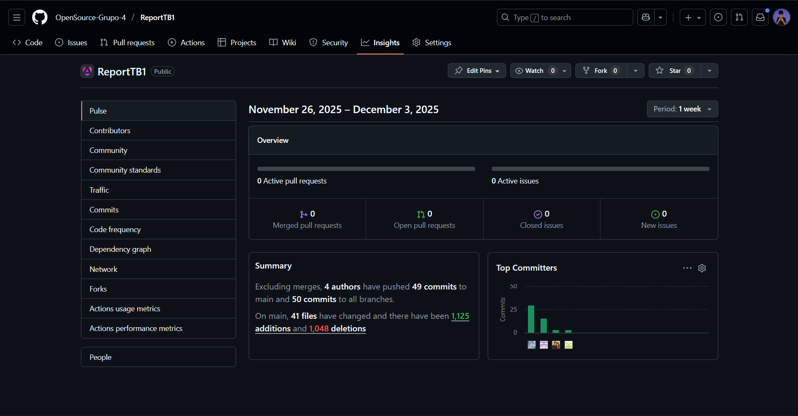
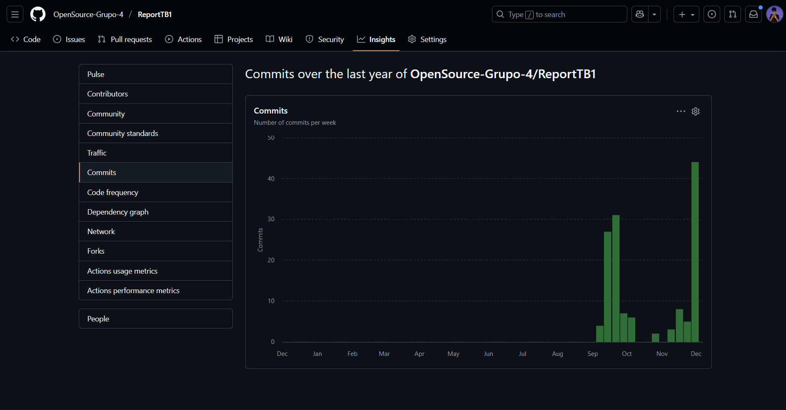
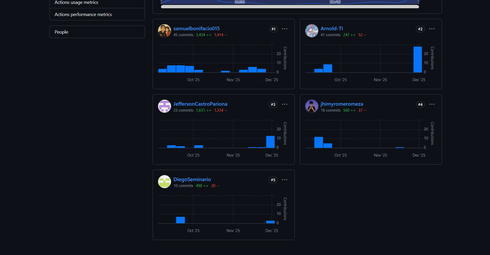

# UNIVERSIDAD PERUANA DE CIENCIAS APLICADAS

# Diseño de Experimentos de Ingeniería de Software (1ASI0732)

## INFORME DE TRABAJO FINAL
## FACULTAD DE INGENIERÍA DE SOFTWARE

### STARTUP: <strong>WeTech</strong>
### PRODUCTO: <strong>WeRide</strong>
### SECCIÓN: 9090
### PROFESOR: Juan Antonio Flores Moroco

---

### INTEGRANTES

<table style="border-collapse: collapse; width: 75%; text-align: center; font-family: Arial; font-size: 16px;">
  <thead>
    <tr>
      <th style="background-color: #333; color: #fff; padding: 10px; border: 1px solid #555;">Apellidos y Nombres</th>
      <th style="background-color: #333; color: #fff; padding: 10px; border: 1px solid #555;">Código</th>
    </tr>
  </thead>
  <tbody>
    <tr>
      <td style="padding: 10px; border: 1px solid #aaa;">Alessandro Franco Sarmiento Mendoza</td>
      <td style="padding: 10px; border: 1px solid #aaa;">U202215537</td>
    </tr>
    <tr>
      <td style="padding: 10px; border: 1px solid #aaa;">Giordano Sebastian Trejo Espejo</td>
      <td style="padding: 10px; border: 1px solid #aaa;">U202316162</td>
    </tr>
    <tr>
      <td style="padding: 10px; border: 1px solid #aaa;">Romero Meza, Jhimy Pool</td>
      <td style="padding: 10px; border: 1px solid #aaa;">U202321510</td>
    </tr>
    <tr>
      <td style="padding: 10px; border: 1px solid #aaa;">Franco Sebastian Laymito Delgado</td>
      <td style="padding: 10px; border: 1px solid #aaa;">U202311959</td>
    </tr>
    <tr>
      <td style="padding: 10px; border: 1px solid #aaa;">Rosangela Silva Hualpa</td>
      <td style="padding: 10px; border: 1px solid #aaa;">U20241B885</td>
    </tr>
  </tbody>
</table>

---

### Lima, Perú – noviembre 2026

<!-- salto de hoja-->

# Registro de Versiones del Informe

El objetivo de esta sección es resumir las modificaciones relevantes que se realizan al informe durante el ciclo de vida del proyecto.  

<table style="border-collapse: collapse; width: 85%; text-align: left; font-family: Arial, sans-serif;">
  <caption style="caption-side: top; text-align: left; font-weight: bold; margin-bottom: 8px;">Tabla: Registro de versiones</caption>
  <thead>
    <tr>
      <th style="background-color: #222; color: #fff; padding: 10px; border: 1px solid #444; width: 12%;">Versión</th>
      <th style="background-color: #222; color: #fff; padding: 10px; border: 1px solid #444; width: 18%;">Fecha</th>
      <th style="background-color: #222; color: #fff; padding: 10px; border: 1px solid #444; width: 20%;">Autor</th>
      <th style="background-color: #222; color: #fff; padding: 10px; border: 1px solid #444;">Descripción de modificación</th>
    </tr>
  </thead>
  <tbody>
    <tr>
      <td style="padding: 10px; border: 1px solid #ccc; font-weight: bold;">V1.0</td>
      <td style="padding: 10px; border: 1px solid #ccc;">10 Sep 2025</td>
      <td style="padding: 10px; border: 1px solid #ccc;">G4 WeTech</td>
      <td style="padding: 10px; border: 1px solid #ccc;">Versión inicial del informe: se completaron los 5 capítulos principales y se desplegó la primera versión del landing page.</td>
    </tr>
    <tr>
      <td style="padding: 10px; border: 1px solid #ccc; font-weight: bold;">V2.0</td>
      <td style="padding: 10px; border: 1px solid #ccc;">21 Sep 2025</td>
      <td style="padding: 10px; border: 1px solid #ccc;">G4 WeTech</td>
      <td style="padding: 10px; border: 1px solid #ccc;">Despliegue de la primera versión de la Web Application y actualización de la documentación técnica asociada.</td>
    </tr>
    <tr>
      <td style="padding: 10px; border: 1px solid #ccc; font-weight: bold;">V3.0</td>
      <td style="padding: 10px; border: 1px solid #ccc;">30 Oct 2025</td>
      <td style="padding: 10px; border: 1px solid #ccc;">G4 WeTech</td>
      <td style="padding: 10px; border: 1px solid #ccc;">Primer despliegue funcional de los Web Services; se añadieron diagramas y API spec en la documentación.</td>
    </tr>
    <tr>
      <td style="padding: 10px; border: 1px solid #ccc; font-weight: bold;">V4.0</td>
      <td style="padding: 10px; border: 1px solid #ccc;">16 Nov 2025</td>
      <td style="padding: 10px; border: 1px solid #ccc;">G4 WeTech</td>
      <td style="padding: 10px; border: 1px solid #ccc;">Revisión y consolidación de la documentación final, correcciones de estilo y ajustes según retroalimentación del docente.</td>
    </tr>
  </tbody>
</table>

# Project Report Collaboration Insights

Para la elaboración del informe del proyecto utilizamos GitHub como herramienta principal para la organización, control de versiones y colaboración del equipo.  
A través del repositorio del informe registramos cambios, realizamos revisiones continuas y mantenemos el historial de actualizaciones alineado con cada entrega del curso.

### Repositorios relevantes
- https://github.com/orgs/OpenSource-Grupo-4/repositories  
- https://github.com/OpenSource-Grupo-4/ReportTB1  
- https://github.com/OpenSource-Grupo-4/Landing-Page  
- https://github.com/OpenSource-Grupo-4/Frontend-WeRide  
- https://github.com/OpenSource-Grupo-4/Backend-WeRide  

---

## Entrega TB1: V1.0

Durante la entrega TB1 el equipo desarrolló el Sprint 1, donde se trabajaron las primeras historias de usuario asociadas al proyecto y se construyó la primera versión de la Landing Page.  
En esta etapa también se inició la estructura del informe, estableciendo la base de contenidos y el orden de secciones.

### Evidencias

---

## Entrega TP1: V2.0

En la entrega TP1 se desarrolló el Sprint 2, enfocado en las historias de usuario del Frontend para la aplicación de alquiler de bicicletas y scooters eléctricas.  
Se trabajó la experiencia del usuario, pantallas principales y simulación del backend utilizando JSON Server para representar datos IoT de localización.

### Evidencias

---

## Entrega TB2: V3.0

En la entrega TB2 el equipo trabajó en el desarrollo del backend utilizando Java, aplicando principios de Domain-Driven Design (DDD) y el patrón CQRS.  
Se implementaron los agregados principales, la lógica del dominio y las capas internas del proyecto siguiendo buenas prácticas de arquitectura.

### Evidencias

---

## Entrega Final (TF): V4.0

En la entrega final se trabajó el Sprint 4, integrando Frontend y Backend, resolviendo incidencias y mejorando la estabilidad general del sistema.  
Adicionalmente, se realizaron mejoras completas al informe, ajustándolo a los requerimientos del curso y asegurando coherencia con el Registro de Versiones.

### Evidencias

<!-- salto de hoja-->

# Contenido
## Tabla de Contenidos
### [Registro de versiones del informe](#registro-de-versiones-del-informe)
### [Project Report Collaboration Insights](#project-report-collaboration-insights)
### [Contenido](#contenido)
### [Student Outcome](#student-outcome-1)

### [Capítulo I: Introducción](/chapter01.md)
- [1.1. Startup Profile](/chapter01.md#11-startup-profile)
    - [1.1.1. Descripción de la Startup](/chapter01.md#111-descripción-de-la-startup)
    - [1.1.2. Perfiles de integrantes del equipo](/chapter01.md#112-perfiles-de-integrantes-del-equipo)
- [1.2. Solution Profile](/chapter01.md#12-solution-profile)
    - [1.2.1 Antecedentes y problemática](/chapter01.md#121-antecedentes-y-problemática)
    - [1.2.2 Lean UX Process](/chapter01.md#12-solution-profile)
        - [1.2.2.1. Lean UX Problem Statements](/chapter01.md#1221-lean-ux-problem-statements)
        - [1.2.2.2. Lean UX Assumptions](/chapter01.md#1222-lean-ux-assumptions)
        - [1.2.2.3. Lean UX Hypothesis Statements](/chapter01.md#1223-lean-ux-hypothesis-statements)
        - [1.2.2.4. Lean UX Canvas](/chapter01.md#1224-lean-ux-canvas)
- [1.3. Segmentos objetivos](/chapter01.md#13-segmentos-objetivos)

### [Capítulo II: Requirements Elicitation & Analysis](/chapter02.md)
- [2.1. Competidores](/chapter02.md#21-competidores)
    - [2.1.1. Análisis competitivo](/chapter02.md#211-análisis-competitivo)
    - [2.1.2. Estrategias y tácticas frente a competidores](/chapter02.md#212-estrategias-y-tácticas-frente-a-competidores)
- [2.2. Entrevistas](/chapter02.md#22-entrevistas)
    - [2.2.1. Diseño de entrevistas](/chapter02.md#221-diseño-de-entrevistas)
    - [2.2.2. Registro de entrevistas](/chapter02.md#222-registro-de-entrevistas)
    - [2.2.3. Análisis de entrevistas](/chapter02.md#223-análisis-de-entrevistas)
- [2.3. Needfinding](/chapter02.md#23-needfinding)
    - [2.3.1. User Persona](/chapter02.md#231-user-persona)
    - [2.3.2. User Task Matrix](/chapter02.md#232-user-task-matrix)
    - [2.3.3. User Journey Mapping](/chapter02.md#233-user-journey-mapping)
    - [2.3.4. Empathy Mapping](/chapter02.md#234-empathy-mapping)
    - [2.3.5. As-is Scenario Mapping](/chapter02.md#235-as-is-scenario-mapping)

### [Capítulo III: Requirements Specification](/chapter03.md)
- [3.1. To-Be Scenario Mapping](/chapter03.md#31-to-be-scenario-mapping)
- [3.2. User Stories](/chapter03.md#32-user-stories)
- [3.3. Product Backlog](/chapter03.md#34-product-backlog)
- [3.4. Impact Mapping](/chapter03.md#33-impact-mapping)

### [Capítulo IV: Product Design](/chapter04.md)
- [4.1. Style Guidelines](/chapter04.md#41-style-guidelines)
    - [4.1.1. General Style Guidelines](/chapter04.md#411-general-style-guidelines)
    - [4.1.2. Web Style Guidelines](/chapter04.md#412-web-style-guidelines)
- [4.2. Information Architecture](/chapter04.md#42-information-architecture)
    - [4.2.1. Organization Systems](/chapter04.md#421-organization-systems)
    - [4.2.2. Labeling Systems](/chapter04.md#422-labeling-systems)
    - [4.2.3. SEO Tags and Meta Tags](/chapter04.md#423-seo-tags-and-meta-tags)
    - [4.2.4. Searching Systems](/chapter04.md#424-searching-systems)
    - [4.2.5. Navigation Systems](/chapter04.md#425-navigation-systems)
- [4.3. Landing Page UI Design](/chapter04.md#43-landing-page-ui-design)
    - [4.3.1. Landing Page Wireframe](/chapter04.md#431-landing-page-wireframe)
    - [4.3.2. Landing Page Mock-up](/chapter04.md#432-landing-page-mock-up)
- [4.4. Web Applications UX/UI Design](/chapter04.md#44-web-applications-uxui-design)
    - [4.4.1. Web Applications Wireframes](/chapter04.md#441-web-applications-wireframes)
    - [4.4.2. Web Applications Wireflow Diagrams](/chapter04.md#442-web-applications-mock-ups)
    - [4.4.3. Web Applications Mock-ups](/chapter04.md#443-web-applications-user-flow-diagrams)
    - [4.4.4. Web Applications User Flow Diagrams](/chapter04.md)
- [4.5. Web Applications Prototyping](/chapter04.md#45-web-applications-prototyping)
- [4.6. Domain-Driven Software Architecture](/chapter04.md#46-domain-driven-software-architecture)
    - [4.6.1. Software Architecture Context Diagram](/chapter04.md#461-software-architecture-context-diagram)
    - [4.6.2. Software Architecture Container Diagrams](/chapter04.md#462-software-architecture-container-diagrams)
    - [4.6.3. Software Architecture Components Diagrams](/chapter04.md#463-software-architecture-components-diagrams)
- [4.7. Software Object-Oriented Design](/chapter04.md#47-software-object-oriented-design)
    - [4.7.1. Class Diagrams](/chapter04.md#471-class-diagrams)
    - [4.7.2. Class Dictionary](/chapter04.md#472-class-dictionary)
- [4.8. Database Design](/chapter04.md#48-database-design)
    - [4.8.1. Database Diagram](/chapter04.md#481-database-diagram)

### [Capítulo V: Product Implementation, Validation & Deployment](/chapter05.md)
- [5.1. Software Configuration Management](/chapter05.md#51-software-configuration-management)
    - [5.1.1. Software Development Environment Configuration](/chapter05.md#511-software-development-environment-configuration)
    - [5.1.2. Source Code Management](/chapter05.md#512-source-code-management)
    - [5.1.3. Source Code Style Guide & Conventions](/chapter05.md#513-source-code-style-guide--conventions)
    - [5.1.4. Software Deployment Configuration](/chapter05.md#514-software-deployment-configuration)
- [5.2. Landing Page, Services & Applications Implementation](/chapter05.md#52-landing-page-services--applications-implementation)
  - [5.2.1. Sprint 1](/chapter05.md#521-sprint-1)
    - [5.2.1.1. Sprint Planning 1](/chapter05.md#5211-sprint-planning-1)
    - [5.2.1.2. Aspect Leaders and Collaborators](/chapter05.md#5212-aspect-leaders-and-collaborators)
    - [5.2.1.3. Sprint Backlog 1](/chapter05.md#5213-sprint-backlog-1)
    - [5.2.1.4. Development Evidence for Sprint Review](/chapter05.md#5214-development-evidence-for-sprint-review)
    - [5.2.1.5. Execution Evidence for Sprint Review](/chapter05.md#5215-execution-evidence-for-sprint-review)
    - [5.2.1.6. Services Documentation Evidence for Sprint Review](/chapter05.md#5216-services-documentation-evidence-for-sprint-review)
    - [5.2.1.7. Software Deployment Evidence for Sprint Review](/chapter05.md#5217-software-deployment-evidence-for-sprint-review)
    - [5.2.1.8. Team Collaboration Insights during Sprint](/chapter05.md#5218-team-collaboration-insights-during-sprint)
  - [5.2.2. Sprint 2](/chapter05.md#522-sprint-2)
    - [5.2.2.1. Sprint Planning 2](/chapter05.md#5221-sprint-planning-2)
    - [5.2.2.2. Aspect Leaders and Collaborators](/chapter05.md#5222-aspect-leaders-and-collaborators)
    - [5.2.2.3. Sprint Backlog 2](/chapter05.md#5223-sprint-backlog-2)
    - [5.2.2.4. Development Evidence for Sprint Review](/chapter05.md#5224-development-evidence-for-sprint-review)
    - [5.2.2.5. Execution Evidence for Sprint Review](/chapter05.md#5225-execution-evidence-for-sprint-review)
    - [5.2.2.6. Services Documentation Evidence for Sprint Review](/chapter05.md#5226-services-documentation-evidence-for-sprint-review)
    - [5.2.2.7. Software Deployment Evidence for Sprint Review](/chapter05.md#5227-software-deployment-evidence-for-sprint-review)
    - [5.2.2.8. Team Collaboration Insights during Sprint](/chapter05.md#5228-team-collaboration-insights-during-sprint)
  - [5.2.3. Sprint 3](/chapter05.md#523-sprint-3)
    - [5.2.3.1. Sprint Planning 3](/chapter05.md#5231-sprint-planning-3)
    - [5.2.3.2. Aspect Leaders and Collaborators](/chapter05.md#5232-aspect-leaders-and-collaborators)
    - [5.2.3.3. Sprint Backlog 3](/chapter05.md#5233-sprint-backlog-3)
    - [5.2.3.4. Development Evidence for Sprint Review](/chapter05.md#5234-development-evidence-for-sprint-review)
    - [5.2.3.5. Execution Evidence for Sprint Review](/chapter05.md#5235-execution-evidence-for-sprint-review)
    - [5.2.3.6. Services Documentation Evidence for Sprint Review](/chapter05.md#5236-services-documentation-evidence-for-sprint-review)
    - [5.2.3.7. Software Deployment Evidence for Sprint Review](/chapter05.md#5237-software-deployment-evidence-for-sprint-review)
    - [5.2.3.8. Team Collaboration Insights during Sprint](/chapter05.md#5238-team-collaboration-insights-during-sprint)
  - [5.2.4. Sprint 4](/chapter05.md#524-sprint-4)
    - [5.2.4.1. Sprint Planning 4](/chapter05.md#5241-sprint-planning-4)
    - [5.2.4.2. Aspect Leaders and Collaborators](/chapter05.md#5242-aspect-leaders-and-collaborators)
    - [5.2.4.3. Sprint Backlog 4](/chapter05.md#5243-sprint-backlog-4)
    - [5.2.4.4. Development Evidence for Sprint Review](/chapter05.md#5244-development-evidence-for-sprint-review)
    - [5.2.4.5. Execution Evidence for Sprint Review](/chapter05.md#5245-execution-evidence-for-sprint-review)
    - [5.2.4.6. Services Documentation Evidence for Sprint Review](/chapter05.md#5246-services-documentation-evidence-for-sprint-review)
    - [5.2.4.7. Software Deployment Evidence for Sprint Review](/chapter05.md#5247-software-deployment-evidence-for-sprint-review)
    - [5.2.4.8. Team Collaboration Insights during Sprint](/chapter05.md#5248-team-collaboration-insights-during-sprint)
  - [5.2.5. Acuerdo de Servicio - SaaS (Terms and Conditions)](/chapter05.md#525-acuerdo-de-servicio---saas-terms-and-conditions)
- [5.3. Validation Interviews](/chapter05.md#53-validation-interviews)
  - [5.3.1. Diseño de Entrevistas](/chapter05.md#531-diseño-de-entrevistas)
  - [5.3.1. Registro de Entrevistas](/chapter05.md#532-registro-de-entrevistas)
  - [5.3.1. Evaluaciones según heurísticas](/chapter05.md#533-evaluaciones-según-heurísticas)
- [5.4. Video About-the-Product](/chapter05.md#54-video-about-the-product)

<!-- salto de hoja-->

# Student Outcome

### ABET - EAC - Student Outcome 4

Criterio: La capacidad de reconocer responsabilidades éticas y profesionales en
situaciones de ingeniería y hacer juicios informados, que deben considerar el
impacto de las soluciones de ingeniería en contextos globales, económicos,
ambientales y sociales.
En el siguiente cuadro se describe las acciones realizadas y enunciados de conclusiones
por parte del grupo, que permiten sustentar el haber alcanzado el logro del ABET –
EAC - Student Outcome 4.

<table style="width:100%; border-collapse:collapse; text-align:left; font-size:14px;">
  <thead>
    <tr style="background:#f2f2f2;">
      <th style="border:1px solid #999; padding:8px; font-weight:bold; text-align:center;">Criterio Específico</th>
      <th style="border:1px solid #999; padding:8px; font-weight:bold; text-align:center;">Acciones Realizadas</th>
      <th style="border:1px solid #999; padding:8px; font-weight:bold; text-align:center;">Conclusiones</th>
    </tr>
  </thead>

  <tbody>
    <!-- CRITERIO 1 -->
    <tr>
      <td style="border:1px solid #999; padding:8px; vertical-align:top; font-weight:bold;">
        Reconoce responsabilidad ética y profesional en situaciones de ingeniería de software
      </td>
                  <td style="border:1px solid #999; padding:8px; vertical-align:top;">
        <strong>Alessandro Franco Sarmiento Mendoza</strong>
        <ul style="margin:4px 0 10px; padding-left:20px;">
          <li><b>AV1:</b> Realizó reuniones de coordinación equivalentes a las de ciclos anteriores, revisando la planificación del frontend, los bounded contexts y la estructura de datos ya construidos, además de validar junto al equipo la decisión de mantener la arquitectura DDD/CQRS del backend, confirmando su vigencia para el enunciado del curso actual.</li>
                    <li><b>TP:</b> Lideró la elaboración de los artefactos faltantes de Needfinding (As-Is y To-Be Scenario Mapping) y la revisión estructural del informe (corrección de numeración y jerarquía del Capítulo V), asumiendo la responsabilidad de mantener la trazabilidad y coherencia del documento ante el equipo y el docente.</li>
        </ul>
        <strong>Romero Meza Jhimy Pool</strong>
        <ul style="margin:4px 0 10px; padding-left:20px;">
          <li><b>AV1:</b> Presentó nuevamente ante el equipo los wireframes, mockups y requerimientos originales del proyecto, explicando el flujo de usuario y la arquitectura DDD ya definida, como base para que el nuevo equipo comprendiera el estado real de WeRide antes de continuar su desarrollo.</li>
          <li><b>TP:</b> [Pendiente]</li>
        </ul>
        <strong>Giordano Sebastian Trejo Espejo</strong>
        <ul style="margin:4px 0 10px; padding-left:20px;">
          <li><b>AV1:</b> Participó en una sesión de planificación equivalente a un Sprint Planning para retomar el proyecto, exponiendo nuevamente el flujo y los requerimientos de funcionalidades clave (como US-24) y el diseño del bounded context de Perfiles, y colaboró en la resolución de inconsistencias detectadas en el informe heredado.</li>
          <li><b>TP:</b> [Pendiente]</li>
        </ul>
        <strong>Franco Sebastian Laymito Delgado</strong>
        <ul style="margin:4px 0 10px; padding-left:20px;">
          <li><b>AV1:</b> Coordinó reuniones para retomar las propuestas de diseño ya definidas, participó en la revisión de la planificación del frontend y la estructura de datos, y organizó junto al equipo la verificación del despliegue ya existente del backend.</li>
          <li><b>TP:</b> [Pendiente]</li>
        </ul>
        <strong>Rosangela Silva Hualpa</strong>
        <ul style="margin:4px 0 10px; padding-left:20px;">
          <li><b>AV1:</b> Se incorporó al equipo y al proyecto WeRide, revisando la documentación y el código heredado del curso anterior para comprender el estado del producto y poder contribuir a su continuidad en este curso.</li>
          <li><b>TP:</b> [Pendiente]</li>
        </ul>
      </td>
      <td style="border:1px solid #999; padding:8px; vertical-align:top;">
        <ul style="margin:4px 0 10px; padding-left:20px;">
          <li><b>AV1:</b> Retomar el proyecto exigió comunicación clara para transferir conocimiento del equipo anterior al nuevo, evitando que se perdiera contexto técnico o de diseño ya validado.</li>
                    <li><b>TP:</b> La corrección oportuna de inconsistencias de numeración y la documentación transparente de decisiones técnicas (como mantener Java/Spring Boot) evitaron que errores de trazabilidad o decisiones no justificadas afectaran la evaluación del informe.</li>
        </ul>
      </td>
    </tr>
    <!-- CRITERIO 2 -->
    <tr>
            <td style="border:1px solid #999; padding:8px; vertical-align:top; font-weight:bold;">
        Emite juicios informados considerando el impacto de las soluciones de ingeniería de
        software en contextos globales,económicos, ambientales y sociales
      </td>
            <td style="border:1px solid #999; padding:8px; vertical-align:top;">
        <strong>Alessandro Franco Sarmiento Mendoza</strong>
        <ul style="margin:4px 0 10px; padding-left:20px;">
          <li><b>AV1:</b> Revisó y actualizó la documentación de los capítulos I, II, IV y V, así como los bounded contexts y criterios de aceptación ya redactados, evaluando qué ajustes eran necesarios para alinear el informe heredado con los requisitos del curso actual.</li>
                    <li><b>TP:</b> Evaluó el impacto de mantener la arquitectura Java + Spring Boot ya desplegada en producción frente a migrar a ASP.NET Core, documentando los riesgos técnicos y de cronograma de dicha decisión; además, redactó la sección de Términos y Condiciones (SaaS) considerando el impacto legal y social del tratamiento de datos personales conforme a la Ley N° 29733.</li>
        </ul>
        <strong>Romero Meza Jhimy Pool</strong>
        <ul style="margin:4px 0 10px; padding-left:20px;">
          <li><b>AV1:</b> Revisó la documentación técnica de wireframes, mockups, frontend y backend ya elaborada, evaluando su vigencia y aportando contexto histórico al nuevo equipo sobre las decisiones de diseño tomadas originalmente.</li>
          <li><b>TP:</b> [Pendiente]</li>
        </ul>
        <strong>Giordano Sebastian Trejo Espejo</strong>
        <ul style="margin:4px 0 10px; padding-left:20px;">
          <li><b>AV1:</b> Revisó la documentación técnica de US-05, el módulo de pagos y el bounded context de Perfiles, evaluando su impacto en la propuesta de valor del producto antes de continuar su desarrollo en este curso.</li>
          <li><b>TP:</b> [Pendiente]</li>
        </ul>
        <strong>Franco Sebastian Laymito Delgado</strong>
        <ul style="margin:4px 0 10px; padding-left:20px;">
          <li><b>AV1:</b> Revisó y consolidó la documentación de los capítulos I, III y V, así como la documentación de APIs y arquitectura del dominio, evaluando qué partes del informe anterior debían mantenerse o ajustarse para este curso.</li>
          <li><b>TP:</b> [Pendiente]</li>
        </ul>
               <strong>Rosangela Silva Hualpa</strong>
        <ul style="margin:4px 0 10px; padding-left:20px;">
          <li><b>AV1:</b> Se incorporó al análisis documental del proyecto, revisando los capítulos existentes del informe para identificar el impacto y alcance real del producto WeRide antes de aportar en esta nueva etapa.</li>
          <li><b>TP:</b> [Pendiente]</li>
        </ul>
      </td>      
      <td style="border:1px solid #999; padding:8px; vertical-align:top;">
        <ul style="margin:4px 0 10px; padding-left:20px;">
          <li><b>AV1:</b> Evaluar qué documentación conservar y qué actualizar permitió al equipo tomar decisiones informadas sobre el alcance real y el impacto del producto en este nuevo ciclo.</li>
                    <li><b>TP:</b> Documentar explícitamente el riesgo de no migrar al stack sugerido por el curso, junto con las condiciones de uso y privacidad del servicio, permitió emitir un juicio informado sobre las implicancias técnicas, legales y sociales del producto WeRide.</li>
        </ul>
      </td>
    </tr>

  </tbody>
</table>

